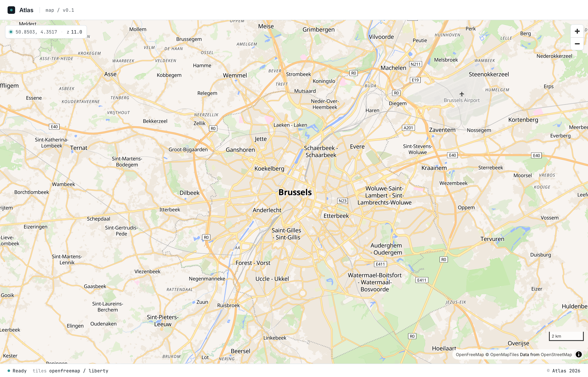

# Remix V3 + MapLibre Example

A small demo app built on the **current beta** of [Remix v3](https://remix.run/) showing how to render an interactive map with [MapLibre GL JS](https://maplibre.org/).

The map uses [OpenFreeMap](https://openfreemap.org/) tiles (the OpenMapTiles schema served free over OpenStreetMap data) with the *Liberty* style, and is wrapped in a small "Atlas" UI shell — a header, a footer with status info, and a live coordinate / zoom readout overlay.



## What's in here

- `app/controllers/map.tsx` — the route handler for `/`, just composes `<Layout>` + `<MapLibreMap>`.
- `app/ui/layout.tsx` — generic page chrome (header, footer, fonts, design tokens) shared by any future route.
- `app/ui/maplibre-map.tsx` — the MapLibre client component (loads `maplibre-gl` on the client via `clientEntry` + `ref`) plus its own `MAP_HEAD` styles.
- `app/routes.ts` — the route contract.
- `app/router.ts` — wires routes to handlers.
- `app/utils/render.tsx` — HTML response rendering helper.

## Commands

```sh
pnpm install
pnpm start         # boot the server
pnpm test
pnpm typecheck
```

Then open <http://localhost:44100/>.

## Notes

- Remix v3 is still in beta; APIs may change.
- Map style: `https://tiles.openfreemap.org/styles/liberty`. Attribution is added automatically by MapLibre.

## How MapLibre is wired up (and why)

MapLibre GL JS is integrated using a **dual-resolution pattern**: the source code imports it as a normal npm package (so TypeScript and the lockfile see a real dependency), but at runtime the browser fetches an ESM build from `esm.sh` via an import map. This section explains why that indirection is necessary and how each piece fits together.

### The problem

Remix v3's asset server (`remix/assets`) compiles browser modules on demand at request time. It is a **strict ESM environment** — it does not bundle, and it cannot ingest CommonJS or UMD modules.

`maplibre-gl@5.x` on npm only ships a single UMD build (`dist/maplibre-gl.js`). It does not publish an ESM entry point. If you let the asset server try to compile a bare `import 'maplibre-gl'`, it fails with:

> This module uses CommonJS (require/module.exports) which is not supported.

So we cannot let the asset server touch maplibre-gl at all. But we still want:

- **Type safety** — `import maplibregl from 'maplibre-gl'` should resolve to the real `.d.ts` from `node_modules`.
- **A pinned version** — pnpm lockfile, dependabot, supply-chain audits, reproducible builds.
- **No CDN URLs hard-coded inside components** — those are a deployment concern, not a component concern.

### The solution: external + import map

Three coordinated pieces make this work:

#### 1. `app/assets.ts` — mark `maplibre-gl` as external

```ts
scripts: {
  external: ['maplibre-gl'],
}
```

This tells the asset server: *"When you see `import 'maplibre-gl'` in a browser module, leave the bare specifier alone. Do not try to resolve, compile, or inline it."* The compiled output emits a literal `import 'maplibre-gl'` that the browser will receive verbatim.

#### 2. `app/ui/maplibre-map.tsx` — author against the real package

```ts
import maplibregl from 'maplibre-gl'
import type { Map as MapLibreMap } from 'maplibre-gl'
```

At type-check time, TypeScript walks `node_modules/maplibre-gl/dist/maplibre-gl.d.ts` and gives full intellisense. At runtime in the browser, this same `import` becomes a bare specifier that needs an external resolver — the import map.

#### 3. `mapHead()` — emit an import map in the document `<head>`

```ts
let importMap = JSON.stringify({ imports: { 'maplibre-gl': moduleUrl } })
return <script type="importmap">{importMap}</script>
```

Where `moduleUrl` is `https://esm.sh/maplibre-gl@5.24.0`. Browsers natively understand `<script type="importmap">` and use it to rewrite bare specifiers in subsequent ES modules. So when the maplibre-map module asks for `maplibre-gl`, the browser fetches it from esm.sh instead.

### Why `esm.sh`?

`esm.sh` is a CDN that, on demand, repackages npm modules as proper ESM. It does the CJS→ESM conversion server-side, caches the result, and serves it with the right MIME type. It's effectively a "polyfill CDN" for packages that haven't shipped ESM yet. The same trick works for any UMD/CJS-only library you want to drop into a Remix v3 app without bundling.

### What about the CSS?

MapLibre's CSS lives at `node_modules/maplibre-gl/dist/maplibre-gl.css`. The asset server's `fileMap` allows `node_modules/*path` to be served from `/assets/...`, so the controller resolves the URL once on the server:

```ts
const MAPLIBRE_CSS_HREF = await assets.getHref('node_modules/maplibre-gl/dist/maplibre-gl.css')
```

…and `mapHead()` emits a `<link rel="stylesheet">` for it. The CSS does not have the CJS problem (it's just CSS), so this is straightforward.

### Why not just bundle it like a normal SPA?

You could run a separate `esbuild` watch process that bundles `maplibre-gl` into a static `entry.js` served from `public/`. It works, but it sidesteps the asset server entirely and gives up server-driven hydration (`clientEntry`). This repo intentionally stays inside the Remix v3 promoted pattern, paying for it with the import-map workaround.

### Drift warning

The version string appears **twice** and they must stay in sync:

- `package.json` → `"maplibre-gl": "^5.24.0"` (drives types + lockfile)
- `mapHead()` → `https://esm.sh/maplibre-gl@5.24.0` (drives runtime)

If you bump one, bump the other. A future improvement would be to read the version from `package.json` at render time so there's a single source of truth.

### Recap — the request lifecycle

1. Server renders the page. Controller resolves `MAPLIBRE_CSS_HREF` from `node_modules` via `assets.getHref(...)`.
2. HTML response includes: import map (`maplibre-gl` → `esm.sh`), CSS `<link>`, and a `<script type="module">` pointing at the asset-server URL for `app/ui/maplibre-map.tsx`.
3. Browser parses the import map first (per spec, must come before any module script that uses it).
4. Browser fetches the maplibre-map module from the asset server. It contains a literal `import 'maplibre-gl'` (because we marked it external).
5. Browser resolves `maplibre-gl` through the import map → fetches ESM bundle from esm.sh.
6. `clientEntry` hydrates the component, the `ref` callback fires, MapLibre instantiates the map.
